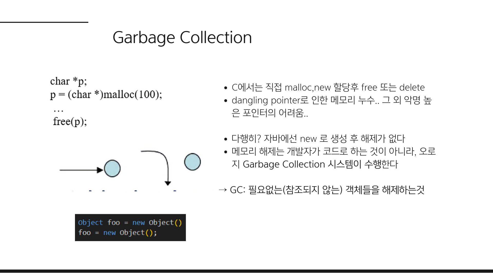
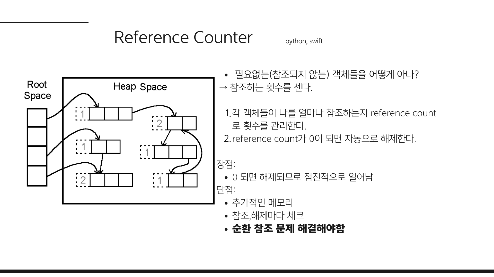
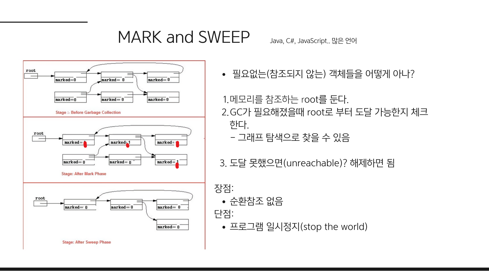
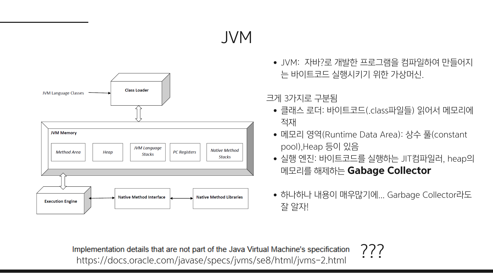
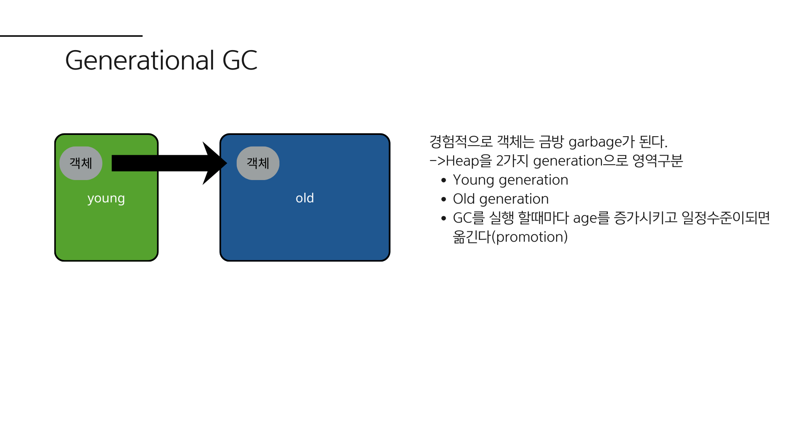
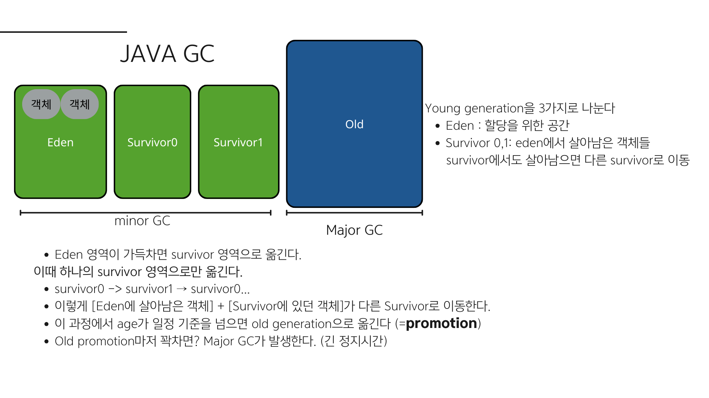

# Garbage Collection (GC)

## 개발자에게 메모리 관리를 맡겨도 되는가?

C언어와 같은 예전 언어에서는 메모리 관리를 개발자가 직접 해야 했습니다.
`malloc()`으로 메모리를 할당하고, 사용이 끝나면 `free()`로 직접 해제해야 했습니다.

하지만 이 방식은 치명적인 단점이 있습니다.
- **개발자의 실수로 인한 메모리 누수:** 개발자가 메모리를 해제하지 않으면 **메모리 누수**가 발생하고, 이미 해제된 메모리 영역을 가리키고 있는 포인터(Dangling Pointer)를 다시 해제하려 하면 에러가 발생합니다.

자바를 비롯한 대부분의 언어가 이러한 문제를 해결하기 위해 **Garbage Collection (GC)** 이라는 개념을 도입했습니다.
개발자가 직접 메모리를 해제하는 대신, **GC가 불필요한 메모리를 알아서 정리**해주는 것입니다.

---

## Garbage Collection이란?

- **Garbage Collection**은 **동적으로 할당됐던 메모리 중 사용하지 않는 객체**를 **자동으로 해제**하는 과정입니다.
- 즉 **Garbage**란, 더 이상 **참조되지 않는 객체**를 의미합니다.

우선, GC의 대표적인 알고리즘 2가지를 먼저 살펴보고 자바의 GC 방식인 Generational GC을 살펴보겠습니다.

### 1. Reference Counting (레퍼런스 카운팅)

객체마다 **자신을 참조하는 횟수**(Reference Count)를 기록하는 방식입니다.
Python이나 Swift 등에서 주로 사용하는 방식입니다.

- 어떤 객체를 참조하는 변수가 늘어나면 카운트를 `+1`, 줄어들면 `-1` 합니다.
- 카운트가 **0이 되면** 해당 객체는 더 이상 사용되지 않는다고 판단하여 **즉시 메모리에서 해제**합니다.

0이 될 때마다 해제를 하고 카운트를 계속 관리하는 오버헤드가 있지만 프로그램을 멈춰서 해제하는(stop the world) 현상은 발생하지 않습니다.  
그러나 이 방법의 가장 큰 문제는 서로가 서로를 참조하는 **순환 참조**(Circular Reference) 문제를 따로 해결할 방법을 찾아야합니다. (보조적으로 Mark-and-Sweep 방식을 사용하여 해결한다던가..)

### 2. Mark-and-Sweep (마크 앤 스윕)

**Java**를 포함한 대부분의 언어가 채택하고 있는 방식입니다.
**Root**(스택, static 변수 등)에서부터 시작하여 객체 간의 참조를 따라가며 **도달 가능한지**(Reachable) 확인합니다.

1.  **Mark:** Root로부터 그래프 순회를 하며 **도달 가능한 객체**(Reachable)를 찾아 마킹합니다.
2.  **Sweep:** 마킹되지 않은, 즉 **도달 불가능한 객체**(Unreachable)들을 메모리에서 제거합니다.

이 방식은 순환 참조 문제를 해결할 수 있지만, 치명적인 단점이 하나 있습니다.
바로 **Stop-The-World (STW)** 입니다.

> **Stop-The-World란?**
>
> GC가 실행되는 동안, **GC를 실행하는 스레드를 제외한 모든 애플리케이션 스레드가 작업을 멈추는 현상**입니다.
> 어떤 GC 알고리즘을 쓰더라도 이 멈춤 현상은 발생하며, GC 튜닝은 보통 이 시간을 줄이는 것을 목표로 합니다.

---
## JVM

자바에서는 어떻게 GC를 하는지 설명하기전에 JVM에대해 간단히 설명드리겠습니다.  
JVM은 자바로 개발한 프로그램을 컴파일하여 만들어지는 바이트코드를 실행시키기 위한 가상머신입니다. (코틀린,스칼라 등등 자바 바이트코드를 만들기만하면 상관없습니다.)

크게 3가지로 구분됩니다.
- 클래스 로더: 바이트코드(.class파일들) 읽어서 메모리에 적재
- 메모리 영역(Runtime Data Area): 상수 풀(constant pool),Heap 등이 있음
- 실행 엔진: 바이트코드를 실행하는 JIT컴파일러, heap의 메모리를 해제하는 **Gabage Collector**

JVM은 하나하나 내용이 매우많기에 따로 찾아보시는걸 추천드립니다.  

> 그전에 잠시..  
사실 JVM specification에는 공식적으로 GC를 어떻게 구현하는지 정의하지 않습니다. 보통은 oracle의 HotSpot이 많이 사용되어 인터넷의 대부분의 자료가 oracle의 HotSpot 기준으로 설명되어 있습니다. 그러나 사실 어떤 버전이냐, 어떤 벤더냐에 따라서도 다릅니다.  
뒤이어 설명할 Generational GC는 자바 뿐만아니라 대부분의 언어가 사용하므로 개념적으로 알아두시고, 언젠가 GC 튜닝이 필요할 때 버전과 벤더에 맞춰 직접 찾아보시는걸 추천드립니다.(G1, ZGC 등등)
 

## Java의 GC 방식: Generational GC

Java는 **Mark-and-Sweep** 방식을 기반으로 하되, 효율성을 위해 **Generational GC (세대별 GC)** 방식을 사용합니다.
개발자들이 경험적으로 아래 2가지 특징을 찾아내었습니다.
- **대부분의 객체는 금방 접근 불가능 상태(Unreachable)가 된다.** (금방 죽는다)
- 오래된 객체에서 젊은 객체로의 참조는 아주 적게 존재한다.  

*약한 세대 가설 (Weak Generational Hypothesis)이라고도 합니다.*

## Heap 메모리의 세대 구조

위 2가지 특징을 바탕으로 Heap 영역을 크게 **Young Generation**과 **Old Generation**으로 물리적으로 나누어 관리합니다.
1.  **Young Generation (젊은 세대):**
    - 새롭게 생성된 객체가 할당되는 곳입니다.
    - 대부분의 객체가 여기서 금방 사라집니다.
    - 여기서 일어나는 GC를 **Minor GC**라고 합니다.
    - **Eden** 영역과 2개의 **Survivor** 영역으로 나뉩니다.

2.  **Old Generation (늙은 세대):**
    - Young 영역에서 오랫동안 살아남은 객체가 이곳으로 이동(**Promotion**)합니다.
    - Young 영역보다 크기가 크며, GC가 적게 발생합니다.
    - 여기서 일어나는 GC를 **Major GC**라고 합니다.

---

## 동작 과정

객체가 생성되고 소멸되는 전체 과정을 단계별로 살펴보겠습니다.

1.  **객체 생성:** 새로운 객체는 무조건 **Eden** 영역에 생성됩니다.
2.  **Eden 영역이 꽉 차면:** **Minor GC**가 발생하여 Survivor로 이동합니다.
    - 사용 중인(Reachable) 객체는 **Survivor 0** 영역으로 옮겨지고,
    - 사용하지 않는 객체는 삭제됩니다.
    - 만약 첫 GC가 아니라서 survivor에 살아있는 객체가 있었다면,  
     Eden과 Survivor 영역에 있던 살아있는 객체들이 모두 **반대편 Survivor**로 이동합니다.
    (만약 이전에 Survivor 1로 이동했었다면 객체는 Survivor 0으로 이동됩니다.)

이 반대편 Survivor 영역으로 옮겨주는 과정을 반복하여 compaction(메모리 단편화 제거)을 진행합니다.

3.  **Age 증가:** Survivor 영역을 오가며 살아남은 객체는 점점 나이(Age)가 증가합니다.
4.  **Promotion** 특정 나이를 넘길 정도로 오래 살아남은 객체는 **Old Generation**으로 이동합니다.
5.  **Old 영역도 꽉 차면:** 시간이 흘러 Old Generation까지 꽉 차게 되면, 그때 **Major GC**가 발생하여 Old 영역을 청소합니다. (이때 Stop-The-World가 길게 발생합니다.)

> 참고사항:  
객체가 Eden보다 크면 바로 Old 영역으로 가기도 합니다.

